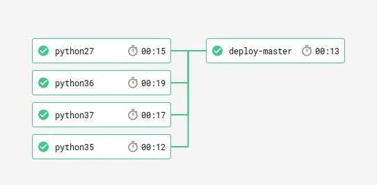
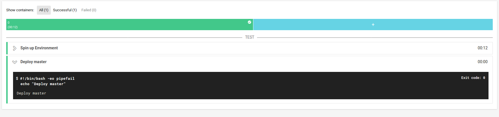
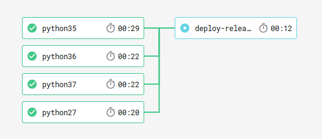
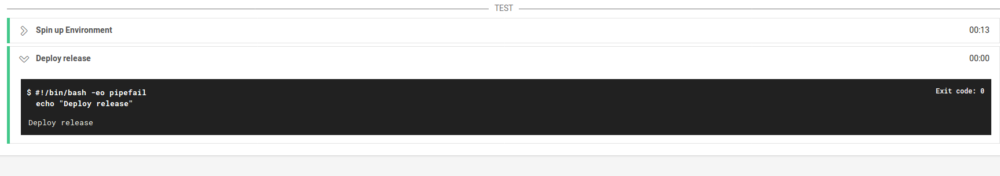

# ci-sandbox

My sandbox for experimenting with CI services.

|              | CircleCI                                  | TravisCI                                 | Appveyor                                     | Azure Pipelines                                              |
|--------------|-------------------------------------------|------------------------------------------|----------------------------------------------|--------------------------------------------------------------|
| Build Status | [![Circle CI][circle-img]][circle-status] | [![TravisCI][travis-img]][travis-status] | [![Appveyor][appveyor-img]][appveyor-status] | [![Build Status][azure-pipeline-img]][azure-pipeline-status] |


[circle-img]: https://circleci.com/gh/jcfr/ci-sandbox.svg?style=svg
[circle-status]: https://circleci.com/gh/jcfr/ci-sandbox

[travis-img]: https://travis-ci.org/jcfr/ci-sandbox.svg?branch=master 
[travis-status]: https://travis-ci.org/jcfr/ci-sandbox

[appveyor-img]: https://ci.appveyor.com/api/projects/status/81c2532cyie43bhu?svg=true
[appveyor-status]: https://ci.appveyor.com/project/jcfr/ci-sandbox

[azure-pipeline-img]: https://dev.azure.com/74forever/ci-sandbox/_apis/build/status/jcfr.ci-sandbox?branchName=master
[azure-pipeline-status]: https://dev.azure.com/74forever/ci-sandbox/_build/latest?definitionId=1&branchName=master


# Disable all notifications

* Appveyor

```
notifications:
  - provider: Email
    on_build_success: false
    on_build_failure: false
    on_build_status_changed: false
```

* CircleCI

The email notification settings are controlled by the user.


* TravisCI

```
notifications:
  email: false
```

# Deployment settings

## CircleCI 2.0

* Two deploy jobs:
  * ``deploy-master``: associated with ``master`` branch
  * ``deploy-release``: associated with a [tag regular expression](https://circleci.com/docs/2.0/configuration-reference/#filters-1): ``/v[0-9]+\.[0-9]+\.[0-9]+/``. See also [Git Tag Job Execution](https://circleci.com/docs/2.0/workflows/#git-tag-job-execution).

Each jobs depend on all other `pythonXY` jobs.

```
workflows:
  version: 2
  test-package-publish:
    jobs:
      [...]
      - deploy-master:
          requires:
            - python27
            - python35
            - python36
            - python37
          filters:
            branches:
              only: master
      - deploy-release:
          requires:
            - python27
            - python35
            - python36
            - python37
          filters:
            tags:
              only: /[0-9]+(\.[0-9]+)*/
            branches:
              ignore: /.*/
```

Submission when ``master`` is updated:





Submission when a tag is pushed:






## CircleCI 1.0 (deprecated)

* Two sections:
  * ``nightly``: associated with ``master`` branch
  * ``release``: associated with a [tag regular expression](https://circleci.com/docs/configuration/#tags): ``/v[0-9]+\.[0-9]+\.[0-9]+/``

  ```
  deployment:
    nightly:
      branch: master
      owner: jcfr
      commands:
        - echo "deployment-nightly"
    release:
      tag: /v[0-9]+\.[0-9]+\.[0-9]+/
      owner: jcfr
      commands:
        - echo "deployment-release"
  ```

  Submission when ``master`` is updated:

  

  Submission after creating and pushing a tag:

  ```
  git tag -s -m "v0.1.0" v0.1.0
  git push origin v0.1.0
  ```

  works as expected:

  

  

## TravisCI

* Two sections each associated with a [script](https://docs.travis-ci.com/user/deployment/script/) provider.

```
deploy:
  - provider: script
    script: echo "deployment-release"
    skip_cleanup: true
    on:
      repo: jcfr/ci-sandbox
      tags: true
  - provider: script
    script: echo "deployment-nightly"
    skip_cleanup: true
    on:
      repo: jcfr/ci-sandbox
      branch: master
```

Here is a submission associated with ``master``:


